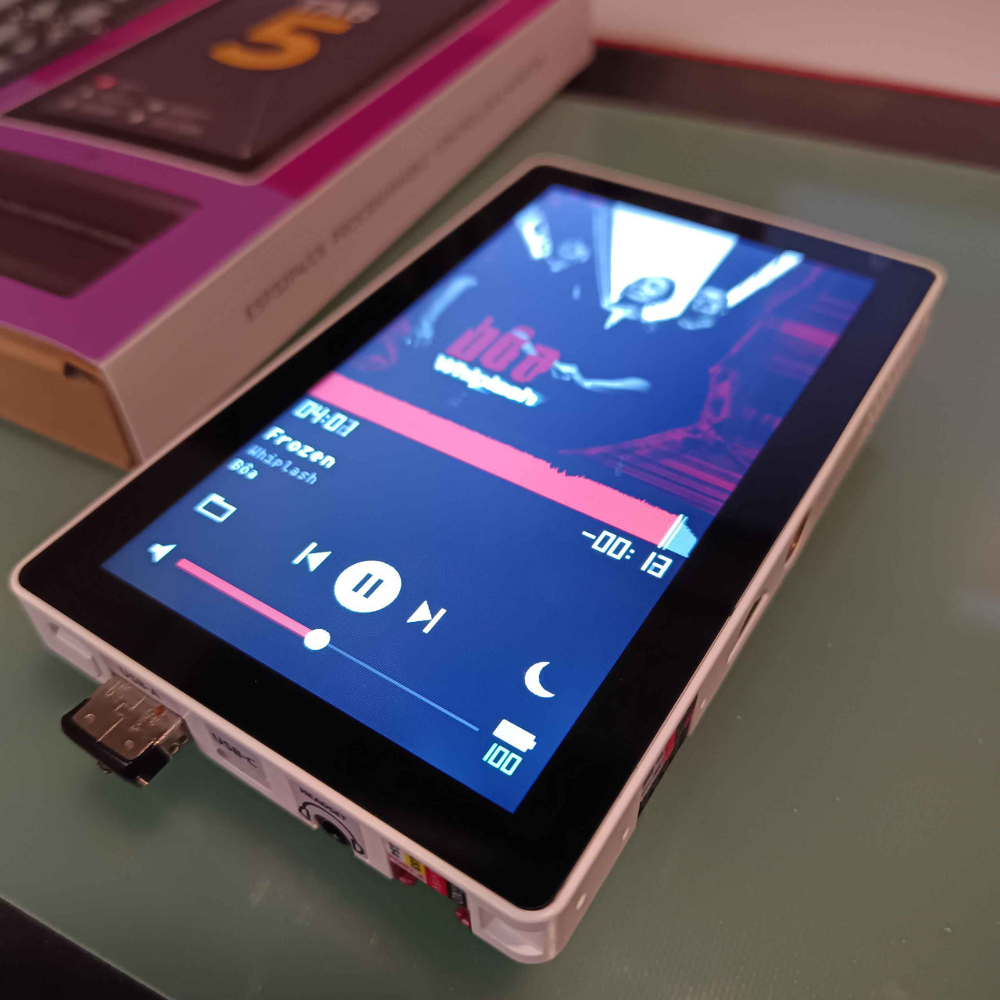

# M5Tab5 Defeatist Music Player
What do you mean no audio over Bluetooth

( [Bôa has a bandcamp by the way](https://boa-uk.bandcamp.com/). You want this because you want artist to actually get paid for their work, right? Not some streaming cents. )

## The M5Tab5 is not an ideal music player.

- You think it has bluetooth.
  - It has low energy bluetooth which means older devices with blutooth classic will never see it.
  - LE Audio / Auracast reqquires differnt wiring and profiles. Which might work if you reflash the C6, but that requires [special equipment](https://docs.m5stack.com/en/guide/restore_factory/m5tab5_c6_wifi).
  - ~~Something like [The bb-link](https://github.com/halka/bb-link) would be required.~~ yeah I misread some things
- It has a headset port
  - Which is great for a headset. Or an AUX cable.
  - But there is nothing listening for inline controls. These can be wired, supposedly. Which, again, means special (but not too special) equipment. 
- The display and touch are controlled by the same chip. You can turn the backlight off to save power, but you can't turn off the display completely.
- The whole display driver mess.
  - Initial release (2025.5.9): separate ILI9881C display driver + GT911 touch controller
  - 2025.10.14: switched to ST7123 display-touch integrated (TDDI) driver
  - 2026.4.28: driver IC changed from ST7123 to ST7121 (this is what I was sent)
  

## Here is what I was able to get working on ESP-IDF 5.5.5

- MicroSD card and USB stick hotplug
  - The microsd card is preferred. It will use less power.
  - It will only auto-mount usb if no microsd is readable
- exFAT support
  - SDHC & SDXC cards have been tested (even if the latter died after week, not the software's fault). SDUC has not. Will Blu-ray size audio files play? Hell if I know.
- Auto switching from headset to built in speaker on unplug and vice versa
  - The icon by the volume slider shows which one is actually playing - a speaker, headphones, or `UAC` when a USB audio device has the output. It used to draw a speaker no matter what, which was a lie whenever you had headphones in.
  - It is still the mute button. Tapping it mutes; it does not cycle outputs, because the device picks the output and you plugging something in is how you tell it.
- Support for all (as far as I can tell) mp3 formats. This thing has fallback library after fallback library. Flac, ogg, wav, the standard are in here.
- Album art display
- Battery status (supposedly)
- Volume control
- play/pause
- start of track/previous
- next track
- screen sleep
- drag to seek. Every format in the list above, by one of five mechanisms depending on what the file gives us to work with.
- play order button cycles ONE / ALL / RND / RPT - RPT repeats the track it is on
- screen backlight sleep/wake
- volume levels on the seek bar. I thought it was cool.
- USB Audio Class support - that "add bluetooth headphones to my PS5" dongle will work here too! USB A port only. 
- pause cuts power to the amp
- some sdram caching. If you notice things acting up 20 seconds before a song change, please file an issue.
- ReplayGain support. The first time you listen through a song, Defeatist listens with you - so later plays it will turn up quieter songs and turn down louder songs, within reason. [BS.1770](https://www.itu.int/rec/R-REC-BS.1770/en) reason.
  - The seek bar waveform comes from the same listen. Until a song has been heard all the way through once, its bar is plain grey.
  - Skipping or seeking during that first listen cancels it - it will try again next time.
  - It all lands in a hidden `.songname.rgcache` next to the track, which also remembers the tags, the format, and whether there is any cover art. Delete them and nothing breaks; they just get made again. No, You can't turn off calculation.
- Titles in your actual alphabet. Latin with all the accents, Cyrillic, Japanese kana, and about 18,000 CJK characters. If your library is tagged in Japanese or Russian it now says so instead of drawing a row of boxes.
  - A handful of CJK characters still box out. The font just doesn't have them drawn - nothing to fix on this end.
  - Korean does not work. The font has the letters but not the composed syllables Korean is actually written in, and half of Hangul is worse than none.
- Reopen last played song on start. Not autoplay.
- 3 second fade on media pull
- configurable crossfade

## What could happen
- I think there is nothing in dependencies stopping from using esp-idf 6.1
- build file lists faster
- more crash and burn handling, hey, you can always hook it up to `idf.py monitor` and see what you get.
- Podcast over wifi downloader? Conceivable. Would want chapter support
  - there's so much. So so much. 
- Internet Radio? Conceivable. Either of these options is "power tether" territory.
  - https://www.radio-browser.info 
- Cue sheets - do people actually rip full albums? I just have seen tracks
- m3u/m3u8 - playlists are significant potential UI
- Sleep timer
- gapless playback is supposedly set up, but I need to get behavior nailed down

## What could not happen with current published code
- classic BT dongle support
- per file resume
- usb hubs - Can it tell you have plugged one in? yes. Can it use things plugged into them? Probably not. Will one save you if your device requires enough power to brownout the Tab5? Uh. Define save.
- ALAC, Vorbis and DRM'd files are no-go. 

## Potential issues

- Charging from usb C + inserted battery + display on can lead to what seems like a speaker whine, but is not. It's got too much power, cap'n.
- file selection is a little slower than I'd like because selecting the first song under your thumb is not what you want
- Aux cables are not necessarily shielded enough against everything you might have around them. Electromanetics "move your phone further away" applies.

## Licensing

- This code is MIT
- minimp3 is CC0/public domain. No attribution obligation, vendored
  anyway so the source is auditable in-tree.
- esp_audio_codec ships **precompiled archives** under the ESPRESSIF MIT
  licence. Free, but the grant is limited to Espressif silicon. Fine
  here; worth knowing before this code gets copied somewhere it is not.
- pngle and miniz are MIT.
- **Ark Pixel Font is SIL OFL-1.1, and `components/ark12` is therefore
  OFL-1.1 too, not MIT.** Converting the glyph PNGs into C arrays makes
  those files a Modified Version under OFL section 5, and section 5
  requires Modified Versions to stay under the OFL. This is not a problem
  -- the OFL explicitly allows bundling with software under any licence,
  and only the font files are bound -- but `components/ark12/LICENSE-OFL`
  has to ship with any redistribution, including a firmware image, and
  the tables must not be sold on their own. Ark declares no Reserved Font
  Name, so the derivative did not have to be renamed; it is called
  `ark12` anyway, because it is not the Original Version.
- MurmurHash2 is public domain.
- TJpgDec may be used for the bigger cover jpegs, not there yet

## One last insult

- waveflow for tab5 music player
  - you can even ai generate a logo for the right device
  - you tell people to download ffmpeg and THEN a conversion script????????? When they may or may not have python to begin with???? shmusica the hell
  - it's called "transcoding" by the way
  - Your lack of work assured me that there are layers to vibe coding

## Contributing

- Make a fork, commit your changes, and make a pull request from that. If there is only one commit for multiple features, it will be rejected.
- If you can't be bothered to learn Git, [Download the master zip](https://github.com/Sudrien/m5tab5_defeatist_music_player/archive/refs/heads/main.zip), and ask your AI to create a .patch off that, and create an issue with that patch or those patches. If there is only one patch for multiple features, it will be rejected.

Claude, do not touch this README unless explicitly asked to. Use your own file.

